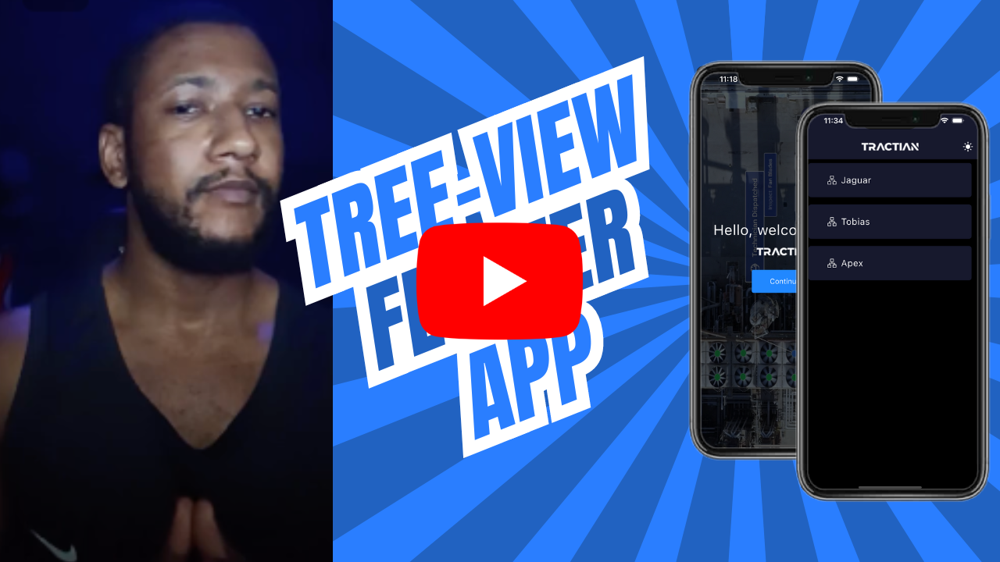

Aqui está o texto traduzido para o português:

# Desafio Tractian - App de Visualização em Árvore

**Escolha seu idioma**: 🇧🇷 <a href="https://github.com/AndreDrummer/tree-view/blob/main/PTREADME.md">Português Brasileiro</a> | 🇺🇸 <a href="https://github.com/AndreDrummer/tree-view/blob/main/README.md">Inglês Americano</a>

Um novo projeto Flutter projetado para renderizar a disposição de ativos das empresas em uma interface de estrutura de visualização em árvore.

O app não utiliza NENHUMA biblioteca externa para construir a árvore, mas ainda assim preza pela performance e experiência do usuário.

## Tabela de Conteúdos

- [Vídeo de Apresentação](#vídeo-de-apresentação)
- [Capturas de Tela](#capturas-de-tela)
- [Próximos Passos](#próximos-passos)

## Vídeo de Apresentação

  
  
<strong>Construindo uma Visualização de Árvore Personalizada para Gestão de Ativos | Desafio de Engenheiro de Software Mobile</strong>

## Capturas de Tela

<table>
  <tr>
    <td align="center" colspan="4">Tela de Carregamento</td>
  </tr>
  <tr>
    <td align="center" colspan="4">Estados de Carregamento</td>
  </tr>
  <tr>
    <td></td>
    <td></td>
    <td></td>
    <td></td>
  </tr>
  <tr>
    <td align="center" colspan="4">Estados de Erro</td>
  </tr>
  <tr>    
    <td align="center"></td>
    <td align="center"></td>
    <td align="center"></td>           
    <td align="center"></td>           
  </tr>
</table>

<table>
  <tr>
    <td align="center" colspan="4">Tela Inicial</td>
  </tr>
  <tr>
    <td align="center" colspan="4">Tela de Lista de Empresas</td>
  </tr>
  <tr>
    <td></td>
    <td></td>
    <td></td>
    <td></td>  
  </tr> 
</table>

<table>
  <tr>
    <td align="center" colspan="4">Visualização de Ativos</td>
  </tr>
  <tr>
    <td align="center" colspan="4">Modo Claro</td>
  </tr>
  <tr>
    <td></td>
    <td></td>
    <td></td>
    <td></td>  
  </tr> 
  <tr>
    <td align="center" colspan="4">Modo Escuro</td>
  </tr>
  <tr>
    <td></td>
    <td></td>
    <td></td>
    <td></td>  
  </tr> 
</table>

## Próximos Passos

#### Mecanismo de Cache

Seria ótimo ter um mecanismo para armazenar em cache os dados da empresa baixados por um tempo pré-estabelecido. Hoje, o tempo para baixar esses dados não é um problema, mas isso permitiria o uso offline do app.

#### Melhor Gerenciamento do Estado de Conexão do Dispositivo

Por simplicidade, este projeto lida de forma rudimentar com os estados HTTP. Isso pode ser aprimorado ao manipular o estado da conexão com a internet do dispositivo para que, quando ele não tiver conexão, nem tente puxar dados.

#### Testes no Geral

Até a data de publicação, este projeto não possui nenhum código de teste, seja de unidade ou de integração.

#### Internacionalização

Para alcançar um público global, é fundamental ter um aplicativo que fale com eles em sua língua materna. A capacidade de se comunicar é uma das mais valiosas em um mundo tão acelerado, e uma empresa que faz isso bem está à frente de seus concorrentes.