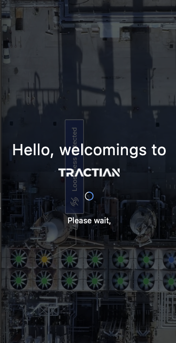
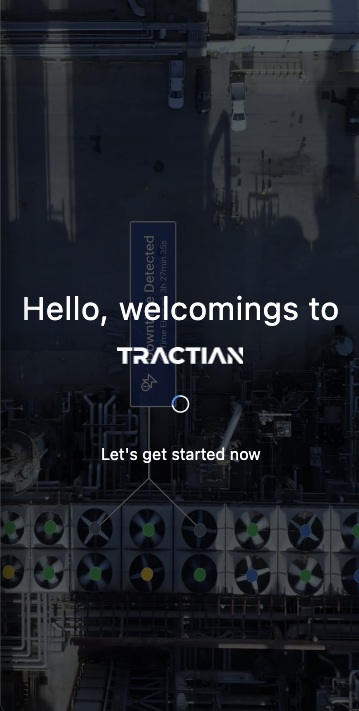
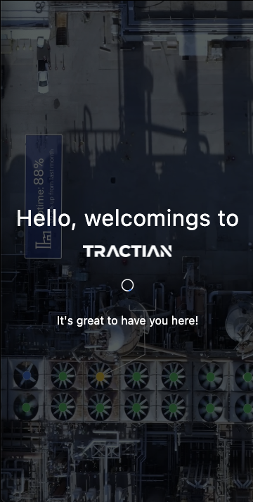
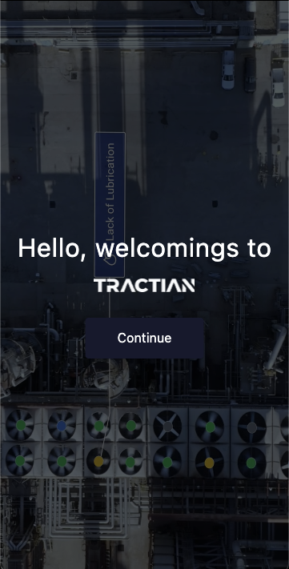
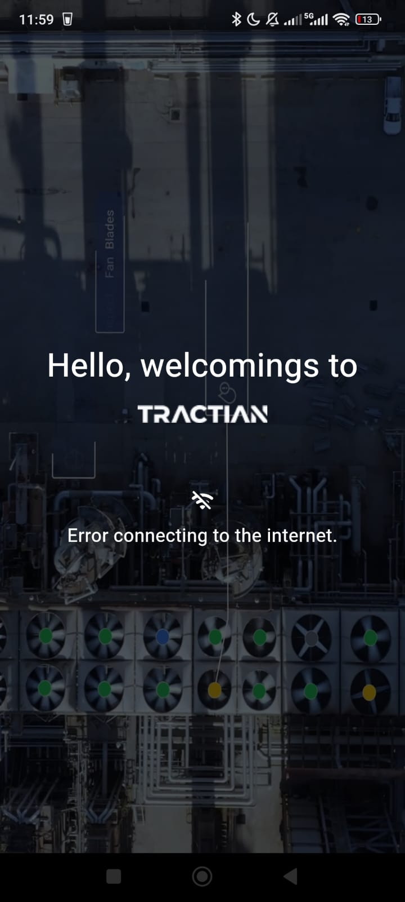
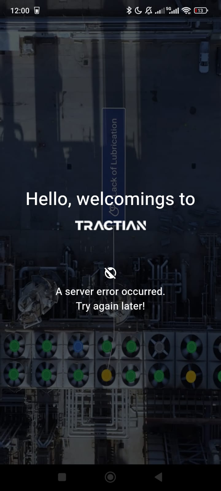
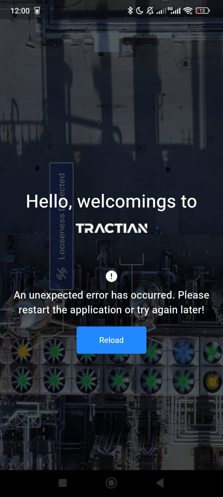

# Tractian Challenge - Tree View App

A new Flutter project designed to render companies' assets disposition in a tree view structure interface.

The difference here is that the app does not use ANY external library but nevertheless values the performance and user experience.

## Table of Contents

- [Building a Custom Tree View for Asset Management](#building-a-custom-tree-view-for-asset-management)
- [Screenshots](#screenshots)
- [What could be better?](#what-could-be-better)
- [Installation](#installation)
- [Contributing](#contributing)
- [License](#license)
- [Acknowledgements](#acknowledgements)

## Building a Custom Tree View for Asset Management

<iframe width="560" height="315" src="https://www.youtube.com/embed/0psuA54bVgQ" frameborder="0" allowfullscreen></iframe>

## Screenshots

<table>
  <tr>
    <td align="center" colspan="4">Splashscreen</td>
  </tr>
  <tr>
    <td align="center" colspan="4">Rounded loading states</td>
  </tr>
  <tr>
    <td></td>
    <td></td>
    <td></td>
    <td></td>
  </tr>
  <tr>
    <td align="center" colspan="4">Error states</td>
  </tr>
  <tr>    
    <td align="center"></td>
    <td align="center"></td>
    <td align="center"></td>           
    <td align="center"></td>           
  </tr>
</table>

## What could be better?
