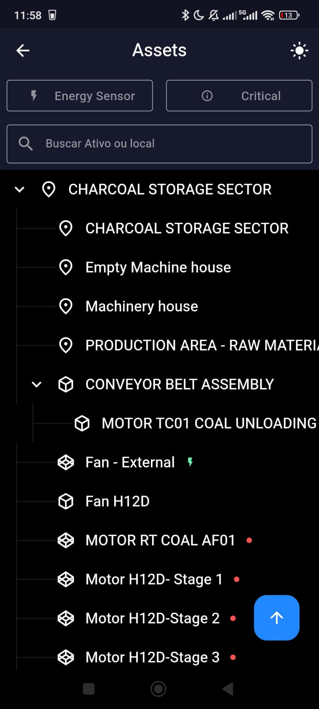

# Tractian Challenge - Tree View App

A new Flutter project designed to render companies' assets disposition in a tree view structure interface.

The difference here is that the app does not use ANY external library but nevertheless values the performance and user experience.

## Table of Contents

- [Presenting Video](#presenting-video)
- [Screenshots](#screenshots)
- [Next steps](#next-steps)

## Presenting Video

  
  
<strong>Building a Custom Tree View for Asset Management | Mobile Software Engineer Challenge</strong>

## Screenshots

<table>
  <tr>
    <td align="center" colspan="4">Splashscreen</td>
  </tr>
  <tr>
    <td align="center" colspan="4">Loading states</td>
  </tr>
  <tr>
    <td></td>
    <td></td>
    <td></td>
    <td></td>
  </tr>
  <tr>
    <td align="center" colspan="4">Error states</td>
  </tr>
  <tr>    
    <td align="center"></td>
    <td align="center"></td>
    <td align="center"></td>           
    <td align="center"></td>           
  </tr>
</table>

<table>
  <tr>
    <td align="center" colspan="4">Home</td>
  </tr>
  <tr>
    <td align="center" colspan="4">Company List Screen</td>
  </tr>
  <tr>
    <td></td>
    <td></td>
    <td></td>
    <td></td>  
  </tr> 
</table>

<table>
  <tr>
    <td align="center" colspan="4">Assets View</td>
  </tr>
  <tr>
    <td align="center" colspan="4">Light Mode</td>
  </tr>
  <tr>
    <td></td>
    <td></td>
    <td></td>
    <td></td>  
  </tr> 
  <tr>
    <td align="center" colspan="4">Dark Mode</td>
  </tr>
  <tr>
    <td></td>
    <td></td>
    <td></td>
    <td></td>  
  </tr> 
</table>

## Next Steps

#### Caching Mechanisim

It would be great to have a mechanism to cache the downloaded company data to live during a pre-established time. Today, the time to pull down this data is not a problem, but it would allow the offline use of the app.

#### Better management device connection state

For simplicity, this project poorly handles the HTTP states. It can sharpened by manipulating the state of the device's internet connection so that when it doesn't have a connection, not even try to pull data.

#### Testings Overall

Until the date of publishing, this project does not have any piece of testing code of kind unity or integration.